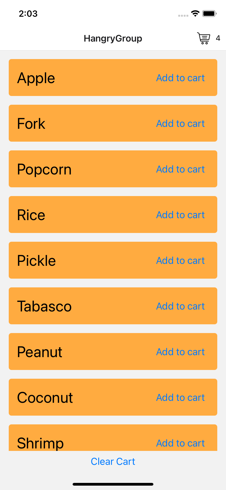
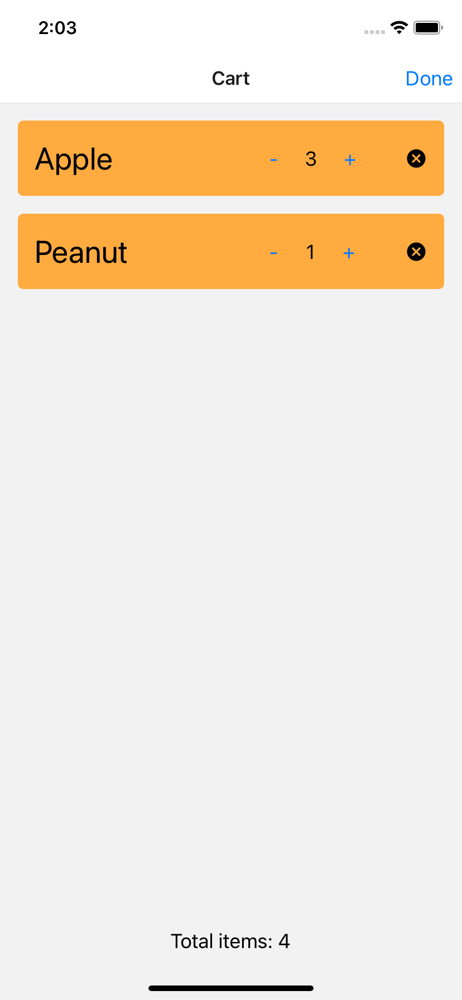

<!-- ABOUT THE PROJECT -->
## About The Project

<p align="center">
  
  
</p>

A very simple shopping cart app.

### Built With

* [React Native](https://reactnative.dev)
* [React Navigation](https://reactnavigation.org)


<!-- GETTING STARTED -->
## Getting Started

### Prerequisites

* npm
  ```sh
  npm install npm@latest -g
  ```

### Installation

1. Clone the repo
    ```sh
    git clone https://github.com/your_username_/Project-Name.git
    ```
2. Install `npm` packages
    ```sh
    npm install
    ```
    ```sh
    npm install -g expo-cli
    ```
3. Start the development server
    ```sh
    expo start
    ```

<!-- LICENSE -->
## License

Distributed under the MIT License.


<!-- CONTACT -->
## Contact

[Steven Yang](http://stevenyang.name) - stevenwaterloo2015@gmail.com

Project Link: [https://github.com/Stevenfly/react-native-shopping-app](https://github.com/Stevenfly/react-native-shopping-app)
